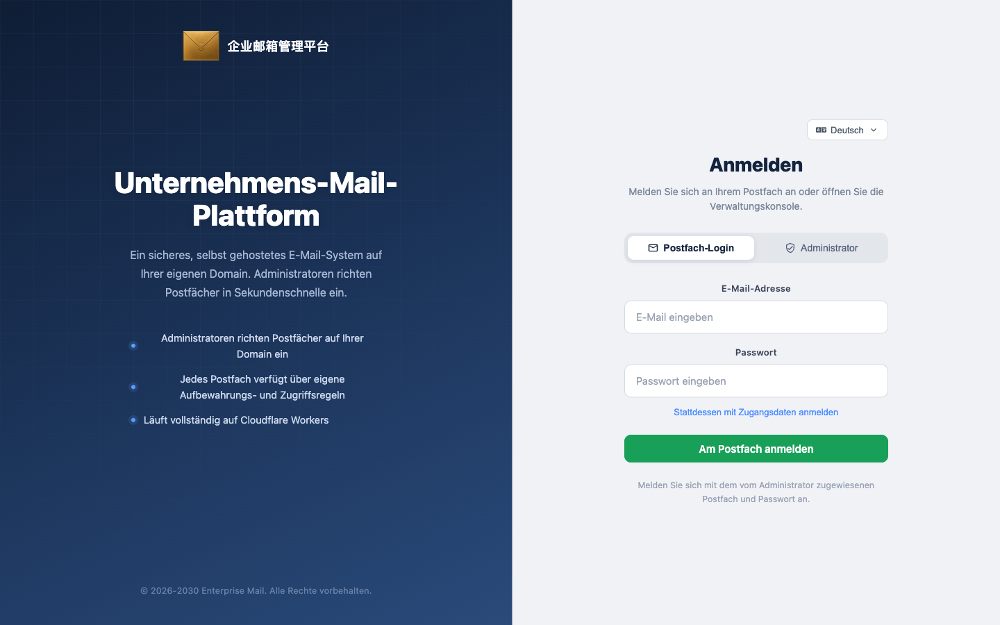

[English](./README.md) · [中文](./README.zh-CN.md) · [Español](./README.es.md) · [Português (Brasil)](./README.pt-BR.md) · [日本語](./README.ja.md) · **Deutsch**


# Enterprise Post Office-**Cloudflare**

**Kein eigener Server erforderlich. Ein vollständiges, stabiles Unternehmens-Postamt, das auf dem Cloudflare-Ökosystem läuft.**


[Highlights](#highlights) · [Das Recht zur Kontoerstellung ist das Produkt](#das-recht-zur-kontoerstellung-ist-das-produkt) · [Schnellstart](#schnellstart) · [Warum Unternehmens-Postamt](#warum-unternehmens-postamt) · [Systemarchitektur](#systemarchitektur) · [English](README.md) · [中文](README.zh-CN.md) · [Español](README.es.md) · [Português](README.pt-BR.md) · [日本語](README.ja.md)

Maintainer: [hiFOFA](https://github.com/hiFOFA/enterprise-post-office-cf) · Mitentwickelt von: [Claude Code](https://www.anthropic.com/claude-code)

Das Unternehmens-Postamt läuft ausschließlich auf Cloudflare: Workers als Schalter, D1 als Hauptbuch und Email Routing als Eingangsdock. Kein Kauf von Servern, kein Betrieb eigener Mailserver. Die Domain empfängt E-Mails und kann nach Freigabe senden.

Dies ist keine temporäre Wegwerf-Mailadresse. Jede Adresse hat in diesem System ein eigenes Passwort und fungiert als vollständiges E-Mail-Portal mit Login, Empfang und Versand. Die Kontoerstellung erfolgt ausschließlich über die Administration: Der Hauptadministrator überwacht die gesamte Instanz, Sub-Administratoren erstellen und verwalten nur ihre eigenen Postfächer, und Postfachbenutzer melden sich mit Adresse und Passwort an, ohne sich selbst registrieren zu können.

Das System stellt für jede Rolle vollständige API-Token bereit, deren Berechtigungen mit der Weboberfläche übereinstimmen. Die Token-Erstellungsseite enthält eine eigene Dokumentation; übergeben Sie dieses Dokument direkt an eine KI, um Empfang, Versand und Postfachverwaltung ohne Quellcode-Recherche zu automatisieren. Die öffentliche API erlaubt keine Selbsterstellung — `POST /api/new_address` antwortet dauerhaft mit 403.



Die Anmeldeseite trennt Postfachbenutzer von Administratoren.

## Highlights

- **Kein eigener Server erforderlich:** Läuft auf dem Cloudflare-Stack ohne eigenen MTA. Worker + D1 + Email Routing bilden das Postamt.
- **Vollständiges E-Mail-Portal, keine Wegwerf-Mail:** Unterstützt Empfang und Versand; jedes Postfach besitzt ein eigenes Passwort statt einer flüchtigen Adresse.
- **Dreistufige Rollenhierarchie, einfache Verwaltung:** Der Hauptadministrator verwaltet alles, Sub-Admins verwalten zugewiesene Postfächer, Benutzer melden sich mit Adresse und Passwort an.
- **Hervorragende Kompatibilität mit Automatisierung und KI:** Jede Rolle kann API-Token mit Web-äquivalenten Berechtigungen erstellen. Dokumentation ist direkt in der Token-Ansicht verfügbar. Docs: [`mailbox-user.md`](frontend/public/api-docs/mailbox-user.md) / [`main-admin.md`](frontend/public/api-docs/main-admin.md) / [`sub-admin.md`](frontend/public/api-docs/sub-admin.md).
- **Kontoerstellung nur durch Administratoren:** `POST /api/new_address` ist fest auf **403** verdrahtet.
- **KI-gestützte Bereitstellung:** Kopieren Sie den Prompt unten, damit ein KI-Agent die Bereitstellung nach Überprüfung der Token schrittweise ausführt.

## Das Recht zur Kontoerstellung ist das Produkt

Viele temporäre Maildienste bieten lediglich eine Adresse. Das Unternehmens-Postamt steuert, wer Postfächer eröffnen darf, wer sie nur nutzt und ob das Senden erlaubt ist. Die Kontrolle bleibt bei Ihnen, während der Betrieb auf Cloudflare läuft.

> **Kurz gesagt:** Sie benötigen lediglich ein Cloudflare-Konto und eine Empfangsdomain. Das Postamt übernimmt Empfang und autorisierten Versand. Jedes Postfach hat ein eigenes Passwort. Anonyme Erstellungsanfragen werden abgewiesen.

Unveränderliche Regeln des Produkts:

1. `POST /api/new_address` gibt immer **403** zurück.
2. Der Hauptadministrator meldet sich mit `ADMIN_USERNAME` / `ADMIN_PASSWORD` an, erstellt Postfächer ohne Punktekosten, verwaltet Sub-Admins, Kontingente, Absenderberechtigungen und Aussehen.
3. Sub-Administratoren verwalten ausschließlich **ihre eigenen** Postfächer mit Punkteabzug pro Domain und einer Gültigkeit von bis zu 90 Tagen.
4. Postfachbenutzer melden sich mit `name@domain` + Passwort (oder Adress-JWT) an, um Mails zu lesen und berechtigte Mails zu senden.
5. Jede Empfangsdomain muss Catch-all in Email Routing aktivieren und auf diesen Worker verweisen.
6. Die DNS-Zone und der Worker müssen sich im **selben** Cloudflare-Konto befinden.
7. Token, Passwörter und Account ID gehören in secrets oder das Dashboard, niemals in git.
8. Nach Abschluss der Bereitstellung temporäre API-Token umgehend widerrufen.

## Schnellstart

Übergeben Sie dieses Repository an Claude, ChatGPT oder Cursor und fügen Sie folgenden Prompt ein:

<p align="center">
  <a href="https://claude.ai"></a>
  <a href="https://chatgpt.com"></a>
  <a href="https://cursor.com"></a>
</p>

```text
请先读取并严格遵守这个技能，然后帮我部署「企业邮箱管理系统」：

https://raw.githubusercontent.com/hiFOFA/enterprise-post-office-cf/main/skills/deploy-cf-post-office/SKILL.md

要求：
1. 先 git clone https://github.com/hiFOFA/enterprise-post-office-cf.git
2. 按技能一项一项问我，收集部署需要的信息
3. 每要一个令牌，都用白话说明它用来干什么；并说明令牌只保存在本次会话，不会写入仓库
4. 问我站点用 Worker 自带的 workers.dev，还是我提供的、已在 Cloudflare 上的域名
5. 令牌验证通过后再部署，不要跳步
6. 完成后只告诉我访问域名；提醒我立刻到 Cloudflare 仪表盘撤销刚才发给你的 API 令牌
```

## Systemarchitektur

- **Cloudflare Workers:** HTTP-Routing, Geschäftslogik und E-Mail-Verarbeitung.
- **Cloudflare D1:** Verteilte relationale SQLite-Datenbank.
- **Cloudflare Email Routing:** Leitet eingehende E-Mails an den Worker weiter.
- **Vue 3 Frontend:** Gebaut und über das `[assets]`-Binding in den Worker integriert.

## Lizenz

[MIT](LICENSE). Version v1.0.

MIT © [hiFOFA](https://github.com/hiFOFA/enterprise-post-office-cf). Upstream: [cloudflare_temp_email](https://github.com/dreamhunter2333/cloudflare_temp_email).
