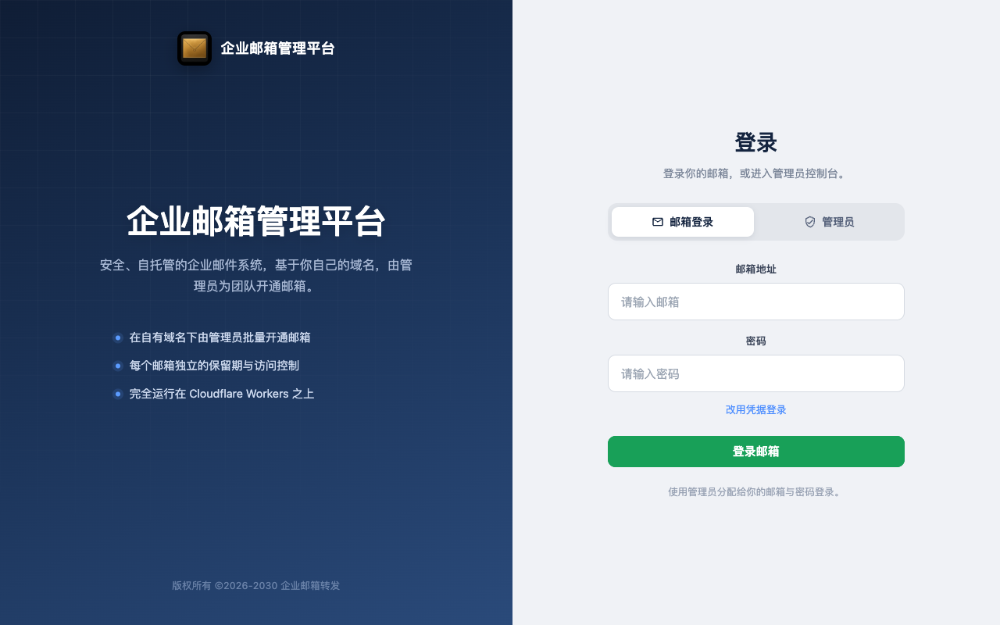
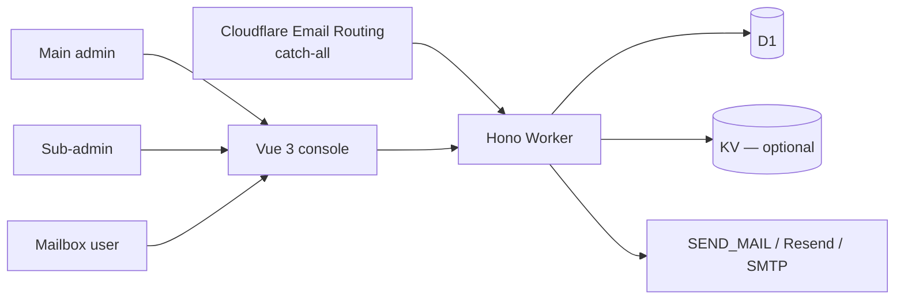

[中文](./README.md) · **English**


# Enterprise Post Office-**Cloudflare**

**No server of your own. A complete, stable enterprise post office that runs on the Cloudflare stack.**


[Highlights](#highlights) · [The product is who may open a box](#the-product-is-who-may-open-a-box) · [Quick start](#quick-start) · [Why this exists](#why-this-exists) · [Architecture](#architecture) · [中文](README.md)

Maintainer: [hiFOFA](https://github.com/hiFOFA/enterprise-post-office-cf)

Enterprise Post Office runs only on Cloudflare: the Worker is the counter, D1 is the ledger, Email Routing is the inbound dock. You do not buy a machine or run a mail server. You receive on your domain, and you send when an address is allowed to.

This is not temp mail. Every address has a password in this system — sign in, receive, send. It is a complete mail portal. Opening a box is an admin action: the main admin sees the whole site, a sub-admin opens and sees only their own boxes, a mailbox user signs in with address + password and cannot register another.

Each role can mint a full API token with the same reach as clicking around the web UI. The token page ships the usage doc; send that doc to an AI and it can send, receive, and operate mail without reading the source. The public API will not mint an address — `POST /api/new_address` is hard-wired to 403.



Login splits mailbox users from administrators.

## Highlights

- **No server of your own:** it runs on the Cloudflare stack. No MTA to operate. Worker + D1 + Email Routing is the post office.
- **A full mail portal, not temp mail:** the system sends and receives; every mailbox has a password here, so you sign into your own box instead of throwing the address away.
- **Three roles, light management:** main admin sees everything, a sub-admin opens only their boxes, a mailbox user enters with address + password. The person who opens a box is not the person who uses it.
- **Works with automation protocols and AI development:** each role can mint a full API token with the same reach as a human on the web UI. The token-creation page includes the usage doc — send that doc to an AI and it can automate send, receive, and the rest. Docs: [`mailbox-user.md`](frontend/public/api-docs/mailbox-user.md) / [`main-admin.md`](frontend/public/api-docs/main-admin.md) / [`sub-admin.md`](frontend/public/api-docs/sub-admin.md).
- **Admin-provisioned only:** `POST /api/new_address` is hard-wired to **403**. The street cannot mint a box.
- **An agent can deploy it too:** paste the prompt below. It reads the deploy skill, explains every token, and deploys only after verification.

## The product is who may open a box

Many temp-mail stacks can hand out an address. This project exists to answer a different question: who may open a box, who may only use one, and whether sending is a default. You keep the control plane. Cloudflare runs the runtime.

> **In short:** you bring a Cloudflare account and a receiving domain. The post office receives mail and sends under permission. Every mailbox has its own password — a portal, not a disposable address. The public API will not give anyone a box.
>
> **What you notice:** no server to buy. Mailbox users sign in with a password. Three roles keep provisioning apart from daily use. Token reach matches the web UI; send the token-page doc to an AI and it can send and receive for you.

The rules are part of the product:

1. Public `POST /api/new_address` is always **403**. Do not open it for convenience.
2. The main admin signs in with `ADMIN_USERNAME` / `ADMIN_PASSWORD`, opens boxes without spending credits, and can create sub-admins, set quota, sending, and appearance.
3. A sub-admin manages **their** boxes only. Default price is one credit per domain; max expiry is 90 days. They cannot create other sub-admins or change the main password.
4. A mailbox user signs in with `name@domain` + password (or an address JWT), reads mail, and sends only if allowed. They cannot mint an address.
5. Every receiving domain needs Email Routing Catch-all pointed at this Worker, or opened boxes stay silent.
6. The DNS zone and the Worker must live in the **same** Cloudflare account. Subdomain receiving is not inherited from the parent zone.
7. Tokens, passwords, and Account ID belong in the dashboard or secrets — never in git.
8. After deploy, revoke the Cloudflare API token you just gave the agent.

**Admins open boxes. The Worker moves mail. Mailbox users read. You keep the domain and the keys.**

## Quick start

Give this repository to Claude, ChatGPT, or Cursor, then paste:

<p align="center">
  <a href="https://claude.ai"></a>
  <a href="https://chatgpt.com"></a>
  <a href="https://cursor.com"></a>
</p>

```text
Read and follow this skill strictly, then deploy Enterprise Mailbox Management System:

https://raw.githubusercontent.com/hiFOFA/enterprise-post-office-cf/main/skills/deploy-cf-post-office/SKILL.md

Requirements:
1. git clone https://github.com/hiFOFA/enterprise-post-office-cf.git first
2. Interview me one question at a time using the skill
3. For every token, explain in plain words what it is for; tokens stay in this chat only and must not be written into the repo
4. Ask whether I want the Worker workers.dev subdomain or a domain I already have on Cloudflare
5. Verify the token before any deploy
6. When done, give me only the public URL; remind me to revoke the Cloudflare API token I just shared
```

The skill lives at [`skills/deploy-cf-post-office/SKILL.md`](skills/deploy-cf-post-office/SKILL.md). In Cursor you can also say “deploy this project using the deploy skill”.

After the site is up, mint an API token on that role’s token page and send the page’s API doc (plus the token) to an AI. It can then send, receive, and manage boxes — with the same reach as a human on the web UI:

- Mailbox user: [`frontend/public/api-docs/mailbox-user.md`](frontend/public/api-docs/mailbox-user.md) (live: `/api-docs/mailbox-user.md`)
- Main admin: [`frontend/public/api-docs/main-admin.md`](frontend/public/api-docs/main-admin.md)
- Sub-admin: [`frontend/public/api-docs/sub-admin.md`](frontend/public/api-docs/sub-admin.md)

For a manual install, see [Full deploy](#full-deploy).

## Why this exists

A full MTA gives you control and also a server that patches, queues, and wakes you up. A public temp-mail page is easy and hands the street the right to open a box. This project keeps the control plane and moves the runtime to Cloudflare. Email Routing is the dock. The Worker is the post office. D1 is the ledger.

| What the usual options get wrong | What this project does | What you get |
|---|---|---|
| You have to buy a server and run an MTA. | Cloudflare only: Worker + D1 + Email Routing. | **No server of your own.** |
| Temp mail: disposable addresses, often receive-only, no password in the product. | Every mailbox has a password; you can sign in, receive, and send. | **A full mail portal.** |
| No roles, or a single admin. | Main admin / sub-admin / mailbox user. | **Light management: open and use are separate.** |
| Automation means reading the source and guessing the API. | Full tokens (same reach as the web UI) plus the usage doc on the token page. | **Send the doc to an AI and it can move mail.** |
| Public temp mail: anyone with the API opens an address. | Only admins mint boxes; public `POST /api/new_address` is always 403. | **No walk-up signup.** |

Public address creation is already off. If you put your own site on the internet, keep it that way.

## Architecture



The project splits provisioning, transport, daily use, and secrets: the main admin plans the site; a sub-admin opens only their boxes; a mailbox user reads mail and sends if allowed; the Worker handles inbound and outbound; D1 records addresses and permissions. No public endpoint mints a box.

Two ways to serve the UI — pick one:

1. **Worker `[assets]`** — `directory = "../frontend/dist"`, `binding = "ASSETS"`, `run_worker_first = true` (see `worker/wrangler.toml.template`). This is the default AI deploy path.
2. **Pages** — deploy `frontend/dist` with `pages/functions/_middleware.js`, which proxies `/api/`, `/admin/`, `/open_api/`, `/telegram/` to the Worker service named in `pages/wrangler.toml`.

### Roles

| Role | Who | What they can do |
|------|-----|------------------|
| **Main admin** | Secrets: `ADMIN_USERNAME` / `ADMIN_PASSWORD` | See every mailbox and who opened it. Open boxes without spending credits. Create sub-admins, add quota, set per-domain price, appearance, send access, IP list, webhooks. Admin JWT goes in `x-admin-auth` (`role: main`). |
| **Sub-admin** | Rows in D1 `sub_admins` | Open and manage **their** boxes only. Same credit pool; default price is 1 per domain; max expiry **90 days**. Cannot create other sub-admins, change the main password, or touch Worker/DB danger settings. `role: sub`. |
| **Mailbox user** | An address that already exists | Sign in at `/login` with `name@domain` + password, or paste the address JWT. Read and (if allowed) send. Cannot mint an address. Local browser cache can hold several mailboxes; “batch delete” only drops the local list. `Authorization: Bearer <jwt>`. |

Optional site-wide gate: `x-custom-auth` when `PASSWORDS` is set. UI language: `x-lang` = `en` / `zh`.

Address occupancy: the row still exists, is not deleted, and is not expired. After expiry or delete the name can be reused. Expired boxes do not receive mail and are not stored.

> [!NOTE]
> Enable Email Routing **Catch-all** on every receiving domain and point it at this Worker. The DNS zone and the Worker must live in the same Cloudflare account. Subdomain receiving is not inherited from the parent zone. Catch-all takes all mail for that domain — do not point it at a production inbox unless that is the intent.

## Full deploy

Prefer **agent-guided, script-executed**: the skill in [Quick start](#quick-start) asks one question at a time, verifies the token, then runs the same steps as below. Wrangler changes Cloudflare. The model should not invent commands.

### Requirements

- A Cloudflare account
- For inbound mail: a domain whose DNS is on **that same account**
- [pnpm](https://pnpm.io) (this repo pins `pnpm@10`)
- Wrangler 4

```bash
git clone https://github.com/hiFOFA/enterprise-post-office-cf.git
cd enterprise-post-office-cf
```

### 1. Database

Create a D1 database and bind it as **`DB`** (the binding name is required).

- New database: apply [`db/schema.sql`](db/schema.sql).
- Existing database: apply the dated files in [`db/`](db/) in order, including the `2026-08-19-sub-admin*.sql` patches.

KV is optional. Bind it as **`KV`** if you want Telegram, webhooks, or the features that store settings there.

### 2. Worker

```bash
cd worker
cp wrangler.toml.template wrangler.toml
```

Edit `wrangler.toml`:

- `DOMAINS` / `DEFAULT_DOMAINS` — suffixes that Email Routing already serves
- D1 (and KV if you use it)
- `nodejs_compat` is already on in the template
- leave `[assets]` commented until the frontend is built, or point it at `../frontend/dist`

Put the main admin in **Wrangler secrets**, not in the file:

```bash
npx wrangler secret put ADMIN_USERNAME
npx wrangler secret put ADMIN_PASSWORD
```

The browser hashes the password with SHA-256 before submit. Keep `keep_vars = true` so a later deploy does not wipe secrets you already set. Do not commit real D1 ids, Worker names, or passwords.

```bash
pnpm i
pnpm deploy
```

### 3. Frontend

```bash
cd frontend
pnpm i
pnpm build          # vite build -m prod  →  frontend/dist   (Worker assets)
# pnpm build:pages  # vite build -m pages →  frontend/dist   (Pages)
```

`VITE_API_BASE` empty means same origin. See [`frontend/.env.example`](frontend/.env.example).

**Worker assets:** uncomment `[assets]` in `worker/wrangler.toml`, then `pnpm deploy` in `worker/` again.

**Pages:**

```bash
cd frontend && pnpm build:pages
cd ../pages && pnpm i && pnpm deploy
```

`pages/wrangler.toml` → `BACKEND.service` must equal the Worker `name`. Turn on SPA fallback on Pages, or a refresh of `/admin` or `/login` 404s.

### 4. Mail path

On each receiving domain: Email Routing → Catch-all → this Worker.

`workers.dev` is blocked in some regions; a custom domain is the reliable front door. Do not put a challenge page in front of the API host — XHR will not pass it.

Need scheduled cleanup? Add a Cron Trigger on the Worker (`[triggers].crons` in the template).

### Commands

| Directory | Dev | Build | Deploy |
|-----------|-----|-------|--------|
| `worker/` | `pnpm dev` | `pnpm build` | `pnpm deploy` |
| `frontend/` | `pnpm dev` | `pnpm build` / `pnpm build:pages` | `pnpm deploy` (Pages) |
| `pages/` | `pnpm dev` | — | `pnpm deploy` (needs `frontend/dist`) |

Optional SMTP/IMAP proxy: `pip install -r smtp_proxy_server/requirements.txt` then `python smtp_proxy_server/main.py`.

Optional WASM parser: `cd mail-parser-wasm && wasm-pack build --release`.

## Configuration

Real values belong in the dashboard, local Wrangler, or secrets. Comments live in [`worker/wrangler.toml.template`](worker/wrangler.toml.template).

| Name | Meaning |
|------|---------|
| `DOMAINS` / `DEFAULT_DOMAINS` | Address suffixes (Email Routing must already be on) |
| `JWT_SECRET` | Address JWT |
| `ADMIN_USERNAME` / `ADMIN_PASSWORD` | Main admin (secrets) |
| `ADMIN_PASSWORDS` | Legacy plaintext fallback |
| `PREFIX` | Default prefix for new local-parts |
| `PASSWORDS` | Optional site-wide gate |
| `TITLE` | Site title |
| `ENABLE_WEBHOOK` | Webhooks; also needs KV |
| `ENABLE_USER_CREATE_EMAIL` | Upstream switch. **This codebase still 403s public `/api/new_address` regardless.** |

Someone else contributing a receiving suffix is not “add a string to `DOMAINS`”. Catch-all can only hit a Worker in **your** account. Either they delegate the zone (or a subdomain) into your Cloudflare, or they add you as an admin of that zone.

Mailbox side, address JWT: `GET /api/parsed_mails`, `GET /api/parsed_mail/:id`, `POST /api/send_mail`. Admin side: `x-admin-auth`. Do not put an admin JWT in `Authorization`.

## Repository layout

```text
worker/                    Hono Worker: receive, send, admin API, cleanup
frontend/                  Vue 3 + Naive UI
pages/                     Pages Functions proxy to the Worker
db/                        D1 schema + dated patches
mail-parser-wasm/          Rust WASM raw-mail parser
smtp_proxy_server/         Optional SMTP/IMAP proxy
skills/deploy-cf-post-office/   Deploy skill for AI agents
docs/screenshots/          README images
docs/brand/                Official logo
```

`worker/wrangler.toml` is gitignored. Copy it from `wrangler.toml.template` and keep it local.

## Verification

Against the live host:

- `GET /health_check` must succeed
- `GET /open_api/bootstrap` must return the site title (no token)
- `GET /open_api/settings` without a login must be **401**
- The home page must be the login screen, not raw JSON
- `POST /api/new_address` must still be **403**

```bash
# frontend unit tests (in frontend/)
pnpm test
```

## Security boundary and limits

- Public self-serve signup is off. Do not turn it on for a demo.
- The main admin password is stored as a Worker secret in plaintext; the browser hashes it with SHA-256 before submit. Do not put passwords in the repo.
- Cloudflare API tokens, Account IDs, and D1 ids stay in the deploy session or the dashboard. Do not commit them.
- Catch-all receives all mail for that domain. Pointing it at a production inbox hands that inbox to this Worker.
- `workers.dev` is blocked in some regions; use a custom domain for a stable front door.
- Do not put a human-challenge page in front of the API host — XHR will not pass it.
- IP denylist, webhooks, and outbound providers are optional. You can receive mail without them.
- Use it for learning and for mail you are allowed to handle. Do not use it to break the law.

## History and license

This project turns [cloudflare_temp_email](https://github.com/dreamhunter2333/cloudflare_temp_email) into an enterprise post office: public signup is closed, and main admin / sub-admin / mailbox user keep provisioning apart from daily use.

[MIT](LICENSE). v1.0 (`frontend/package.json`, `worker/package.json`).

MIT © maintainer [hiFOFA](https://github.com/hiFOFA/enterprise-post-office-cf). Upstream copyright is in [LICENSE](LICENSE).

---

<sub>Special thanks: this project is based on <a href="https://github.com/dreamhunter2333/cloudflare_temp_email">cloudflare_temp_email</a>.</sub>
