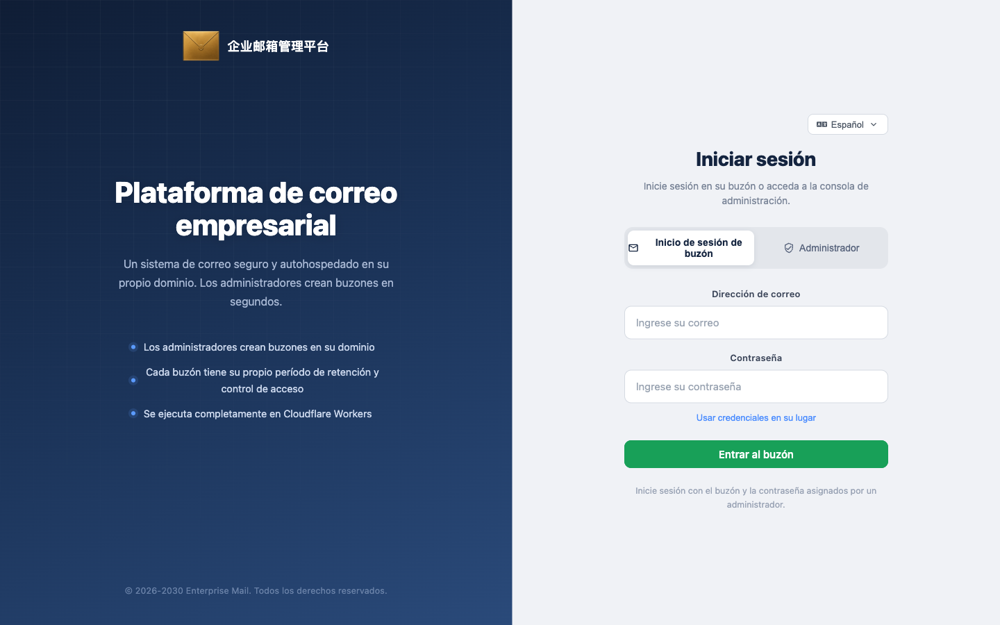

[English](./README.md) · [中文](./README.zh-CN.md) · **Español** · [Português (Brasil)](./README.pt-BR.md) · [日本語](./README.ja.md) · [Deutsch](./README.de.md)


# Enterprise Post Office-**Cloudflare**

**Sin necesidad de servidor propio. Una oficina de correo empresarial completa y estable que se ejecuta en el ecosistema de Cloudflare.**


[Puntos destacados](#puntos-destacados) · [El derecho de crear cuentas es el producto](#el-derecho-de-crear-cuentas-es-el-producto) · [Inicio rápido](#inicio-rápido) · [Por qué correo empresarial](#por-qué-correo-empresarial) · [Arquitectura](#arquitectura) · [English](README.md) · [中文](README.zh-CN.md) · [Português](README.pt-BR.md) · [日本語](README.ja.md) · [Deutsch](README.de.md)

Mantenedor: [hiFOFA](https://github.com/hiFOFA/enterprise-post-office-cf) · Co-creado con: [Claude Code](https://www.anthropic.com/claude-code)

La oficina de correos empresarial se ejecuta exclusivamente en Cloudflare: Workers actúa como mostrador, D1 como libro mayor y Email Routing como muelle de recepción. Sin comprar servidores ni mantener infraestructura de correo. El dominio recibe correos y, una vez autorizado, puede enviar.

Esto no es un correo temporal. Cada dirección tiene su propia contraseña en este sistema, permitiendo iniciar sesión, recibir y enviar como un portal de correo completo. La creación de cuentas se realiza únicamente desde el panel de administración: el administrador principal supervisa todo el sitio, el subadministrador solo crea y gestiona sus propios buzones, y los usuarios acceden con su dirección y contraseña sin poder registrarse libremente.

El sistema emite tokens de API completos para cada rol con los mismos permisos que la interfaz web. La página de creación de tokens incluye su propia documentación; envíe ese documento directamente a una IA para automatizar la recepción, el envío y la gestión sin necesidad de revisar el código fuente. La interfaz pública no permite la auto-creación — `POST /api/new_address` responde siempre 403.



La página de inicio de sesión separa a los usuarios de buzón de los administradores.

## Puntos destacados

- **Sin necesidad de servidor propio:** Se ejecuta en el ecosistema de Cloudflare sin configurar MTA. Worker + D1 + Email Routing conforman la oficina de correos.
- **Portal de correo completo, no correo temporal:** El sistema permite recibir y enviar correos; cada dirección cuenta con contraseña propia en lugar de ser una dirección desechable.
- **Tres niveles de identidad, gestión sencilla:** El administrador principal supervisa todo, el subadministrador gestiona sus buzones asignados y los usuarios acceden con su dirección y contraseña.
- **Excelente compatibilidad con protocolos de automatización e IA:** Cada rol puede emitir tokens de API con los mismos permisos que la interfaz web. La documentación de API se incluye directamente en la página de tokens. Docs: [`mailbox-user.md`](frontend/public/api-docs/mailbox-user.md) / [`main-admin.md`](frontend/public/api-docs/main-admin.md) / [`sub-admin.md`](frontend/public/api-docs/sub-admin.md).
- **Creación de cuentas exclusiva de administradores:** `POST /api/new_address` devuelve **403** permanentemente.
- **Implementación asistida por IA:** Copie el prompt a continuación para que un agente de IA configure y despliegue el sistema paso a paso tras verificar los tokens.

## El derecho de crear cuentas es el producto

Muchos servicios de correo temporal pueden otorgar una dirección. La oficina de correos empresarial controla quién tiene derecho a abrir buzones, quién solo puede utilizarlos y si el envío está habilitado. El control permanece con usted, ejecutándose en Cloudflare.

> **En resumen:** Solo necesita una cuenta de Cloudflare y un dominio para recibir correos. La oficina postal gestiona la recepción y el envío según permisos. Cada buzón tiene contraseña propia. Las solicitudes públicas anónimas quedan bloqueadas.

Reglas inmutables del producto:

1. `POST /api/new_address` devuelve siempre **403**.
2. El administrador principal accede con `ADMIN_USERNAME` / `ADMIN_PASSWORD`, crea buzones sin límite de puntos, gestiona subadministradores, cuotas, remitentes y apariencia.
3. El subadministrador gestiona únicamente **sus propios** buzones, con deducción de puntos por dominio y validez de hasta 90 días.
4. El usuario del buzón inicia sesión con `usuario@dominio` + contraseña (o JWT de dirección) para leer y enviar correo permitido.
5. Cada dominio de recepción debe tener habilitado Catch-all en Email Routing apuntando a este Worker.
6. La zona DNS y el Worker deben residir en la **misma** cuenta de Cloudflare.
7. Tokens, contraseñas y Account ID deben mantenerse en secrets o panel de control, nunca en git.
8. Revocar los tokens de API temporales una vez completado el despliegue.

## Inicio rápido

Entregue este repositorio a Claude, ChatGPT o Cursor y pegue el siguiente texto:

<p align="center">
  <a href="https://claude.ai"></a>
  <a href="https://chatgpt.com"></a>
  <a href="https://cursor.com"></a>
</p>

```text
请先读取并严格遵守这个技能，然后帮我部署「企业邮箱管理系统」：

https://raw.githubusercontent.com/hiFOFA/enterprise-post-office-cf/main/skills/deploy-cf-post-office/SKILL.md

要求：
1. 先 git clone https://github.com/hiFOFA/enterprise-post-office-cf.git
2. 按技能一项一项问我，收集部署需要的信息
3. 每要一个令牌，都用白话说明它用来干什么；并说明令牌只保存在本次会话，不会写入仓库
4. 问我站点用 Worker 自带的 workers.dev，还是我提供的、已在 Cloudflare 上的域名
5. 令牌验证通过后再部署，不要跳步
6. 完成后只告诉我访问域名；提醒我立刻到 Cloudflare 仪表盘撤销刚才发给你的 API 令牌
```

## Arquitectura del sistema

- **Cloudflare Workers:** Enrutamiento HTTP, lógica de negocio y despacho de correo.
- **Cloudflare D1:** Base de datos relacional SQLite distribuida.
- **Cloudflare Email Routing:** Enrutamiento de correo entrante hacia el Worker.
- **Frontend Vue 3:** Compilado e integrado en el Worker a través del binding `[assets]`.

## Licencia

[MIT](LICENSE). Versión v1.0.

MIT © [hiFOFA](https://github.com/hiFOFA/enterprise-post-office-cf). Upstream: [cloudflare_temp_email](https://github.com/dreamhunter2333/cloudflare_temp_email).
