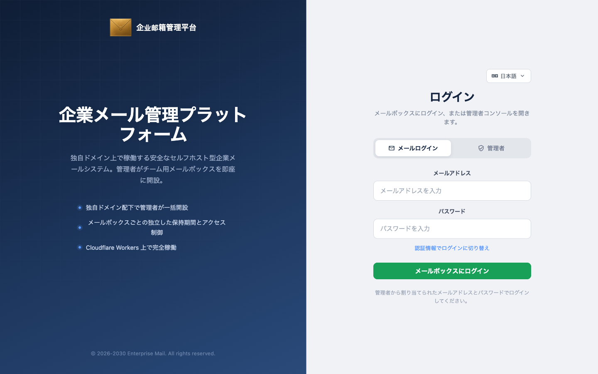

[English](./README.md) · [中文](./README.zh-CN.md) · [Español](./README.es.md) · [Português (Brasil)](./README.pt-BR.md) · **日本語** · [Deutsch](./README.de.md)


# Enterprise Post Office-**Cloudflare**

**自前サーバー不要。Cloudflare エコシステム上で稼働する完全かつ安定した企業向けメールシステム。**


[主な特徴](#主な特徴) · [アカウント開設権こそが製品の本質](#アカウント開設権こそが製品の本質) · [クイックスタート](#クイックスタート) · [なぜ企業メールが必要か](#なぜ企业メールが必要か) · [システム構成](#システム構成) · [English](README.md) · [中文](README.zh-CN.md) · [Español](README.es.md) · [Português](README.pt-BR.md) · [Deutsch](README.de.md)

メンテナー: [hiFOFA](https://github.com/hiFOFA/enterprise-post-office-cf) · 共同開発: [Claude Code](https://www.anthropic.com/claude-code)

企業ポストオフィスは Cloudflare 上でのみ動作します：Workers が窓口、D1 が台帳、Email Routing が受信ゲートウェイとして機能します。サーバーの購入やメールサーバーの保守は一切不要です。独自ドメインでメールを受信し、権限付与後に送信も行えます。

これは使い捨ての一時メール（Temp Mail）ではありません。すべてのメールアドレスに個別のパスワードが設定され、ログイン、送受信が可能な本格的なメールポータルです。アカウント開設は管理コンソールからのみ行われます：メイン管理者は全体を統括し、サブ管理者は自身の割り当てられたボックスのみを開設・管理、一般ユーザーはアドレスとパスワードで自身の受信箱にログインし、勝手に新規登録することはできません。

各ロールには Web 画面と同等の操作権限を持つ完全な API トークンを発行できます。トークン作成画面には仕様ドキュメントが付属しており、そのドキュメントを直接 AI に渡すだけで、ソースコードを読まずに自動送受信やボックス管理の自動化を組み込むことができます。公開エンドポイントからの勝手なアカウント作成は不可 — `POST /api/new_address` は恒久的に 403 を返します。



ログイン画面で一般ユーザーと管理者を明確に分離。

## 主な特徴

- **自前サーバー不要：** Cloudflare 上で完結。MTAの構築・運用は不要です。Worker + D1 + Email Routing がポストオフィスを構成します。
- **一時メールではなく完全なメールポータル：** 送受信に対応し、各アドレスにパスワードが存在するため、使い捨てではなく継続利用が可能です。
- **3段階のロール管理：** メイン管理者が全体を管理、サブ管理者が自身のボックスを開設、一般ユーザーはアドレスとパスワードでログイン。開設者と利用者を分離。
- **自動化プロトコルおよび AI 開発への高い親和性：** 各ロールに応じた API トークンを発行可能。トークン作成画面に付属するドキュメントを AI に渡すだけで送受信の自動化が可能。ドキュメント：[`mailbox-user.md`](frontend/public/api-docs/mailbox-user.md) / [`main-admin.md`](frontend/public/api-docs/main-admin.md) / [`sub-admin.md`](frontend/public/api-docs/sub-admin.md)。
- **管理者のみが開設可能：** `POST /api/new_address` は **403** に固定。
- **AI によるデプロイ支援：** 以下のプロンプトを AI に貼り付けることで、手順に沿った安全なデプロイが可能です。

## アカウント開設権こそが製品の本質

多くの一時メールサービスはアドレスを提供するだけです。企業ポストオフィスが真に管理するのは「誰が開設権を持ち、誰が利用のみを行うか、送信を許可するか」という点です。管理権限はお手元に残り、稼働は Cloudflare に委ねられます。

> **端的に言えば：** 必要なのは Cloudflare アカウントと独自ドメインのみ。システムが受信と権限に応じた送信を処理します。各ボックスは個別のパスワードを持ちます。公開 API からの勝手な開設は拒否されます。

製品の基本原則：

1. `POST /api/new_address` は常に **403** を返します。
2. メイン管理者は `ADMIN_USERNAME` / `ADMIN_PASSWORD` でログインし、ポイント無制限で開設、サブ管理者・クォータ・送信権限・外観を設定します。
3. サブ管理者は**自身が作成した**ボックスのみを管理し、ドメインごとにポイントを消費、有効期限は最長90日です。
4. 一般ユーザーは `ユーザー名@ドメイン` + パスワード（またはアドレス JWT）でログインし、閲覧および許可された送信を行います。
5. 各受信ドメインは Email Routing の Catch-all を有効化し、この Worker に向ける必要があります。
6. DNS ゾーンと Worker は**同一の** Cloudflare アカウント内に存在する必要があります。
7. トークン、パスワード、Account ID は secrets またはダッシュボードでのみ管理し、git に含めないでください。
8. デプロイ完了後は、使用した一時 API トークンを直ちに失効させてください。

## クイックスタート

本リポジトリを Claude、ChatGPT、または Cursor に渡し、以下のプロンプトを貼り付けてください：

<p align="center">
  <a href="https://claude.ai"></a>
  <a href="https://chatgpt.com"></a>
  <a href="https://cursor.com"></a>
</p>

```text
请先读取并严格遵守这个技能，然后帮我部署「企业邮箱管理系统」：

https://raw.githubusercontent.com/hiFOFA/enterprise-post-office-cf/main/skills/deploy-cf-post-office/SKILL.md

要求：
1. 先 git clone https://github.com/hiFOFA/enterprise-post-office-cf.git
2. 按技能一项一项问我，收集部署需要的信息
3. 每要一个令牌，都用白话说明它用来干什么；并说明令牌只保存在本次会话，不会写入仓库
4. 问我站点用 Worker 自带的 workers.dev，还是我提供的、已在 Cloudflare 上的域名
5. 令牌验证通过后再部署，不要跳步
6. 完成后只告诉我访问域名；提醒我立刻到 Cloudflare 仪表盘撤销刚才发给你的 API 令牌
```

## システム構成

- **Cloudflare Workers:** HTTP ルーティング、ビジネスロジック、メール処理。
- **Cloudflare D1:** 分散 SQLite リレーショナルデータベース。
- **Cloudflare Email Routing:** 受信メールを Worker に転送。
- **Vue 3 フロントエンド:** ビルドされ `[assets]` バインディングを通じて Worker に統合。

## ライセンス

[MIT](LICENSE). バージョン v1.0。

MIT © [hiFOFA](https://github.com/hiFOFA/enterprise-post-office-cf). Upstream: [cloudflare_temp_email](https://github.com/dreamhunter2333/cloudflare_temp_email).
