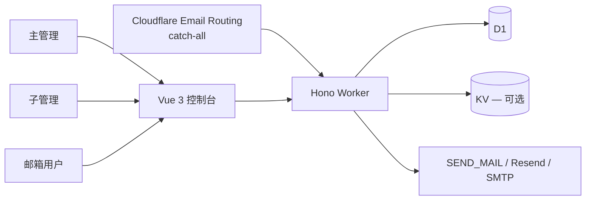

**中文** · [English](./README.en.md)


# 企业邮局-**Cloudflare**

**不用自备服务器。这是一个运行在 Cloudflare 生态上的完整、稳定的企业邮局。**


[项目亮点](#项目亮点) · [开号权就是产品](#开号权就是产品) · [快速开始](#快速开始) · [为什么需要企业邮局](#为什么需要企业邮局) · [系统架构](#系统架构) · [English](README.en.md)

维护者：[hiFOFA](https://github.com/hiFOFA/enterprise-post-office-cf)

企业邮局只跑在 Cloudflare 上：Workers 当柜台，D1 当台账，Email Routing 当进港码头。不用买机器、不用养邮件服务器。域名能收信，获准后能发信。

这不是临时邮箱。每个地址在本系统里都有自己的密码，能登录、能收、能发，是一套完整的邮箱门户。开号只走管理端：主管理看全站，子管理只开、只看自己的箱子，邮箱用户用地址 + 密码进自己的信箱，不能自己注册。

系统给每个角色发完整 API 令牌，权限和网页上人去点的一样丰富。令牌创建页自带使用文档；把文档直接发给 AI，就能接入自动化收信、发信、管箱子，不必自己翻源码。公开接口不会给人自己开号——`POST /api/new_address` 写死 403。


登录页把邮箱用户和管理员分开。

## 项目亮点

- **不用自备服务器：** 跑在 Cloudflare 生态上，不用自己搭 MTA。Worker + D1 + Email Routing 就是邮局。
- **完整邮箱门户，不是临时邮箱：** 系统提供收和发；每个邮箱在本系统都有密码，能登录自己的箱子，而不是用完即走的一次性地址。
- **三级身份，轻松管理：** 主管理看全站，子管理只开自己的箱子，邮箱用户用地址 + 密码进门户。开号的人和用箱的人分开。
- **对自动化协议以及 AI 开发兼容很好：** 每个角色都能发完整 API 令牌，权限和网页上手动操作一样丰富。令牌创建页就有配套使用文档，把文档直接发给 AI，就能接入自动化收信、发信等功能。文档：[`mailbox-user.md`](frontend/public/api-docs/mailbox-user.md) / [`main-admin.md`](frontend/public/api-docs/main-admin.md) / [`sub-admin.md`](frontend/public/api-docs/sub-admin.md)。
- **只许管理端开号：** `POST /api/new_address` 写死 **403**。街上打公开接口领不到号。
- **AI 也能帮你部署：** 复制下面的提示词，智能体会读部署技能，白话说明令牌用途，验证通过后再上线。

## 开号权就是产品

许多临时邮箱都能给人一个地址。企业邮局真正管住的是另一件事：谁有权开箱，谁只能用箱，发信是不是默认值。控制权留在你这边，运行时放到 Cloudflare。

> **简单来说：** 你只准备一个 Cloudflare 账号和收信域名。邮局负责收信、按权限发信；每个邮箱有自己的密码，是门户不是临时箱。街上打公开接口领不到号。
>
> **你能直接感受到的变化：** 不用自备服务器。邮箱用户用密码进自己的信箱。三级身份把开号和用箱分开。令牌权限跟网页一样完整，把令牌页的文档发给 AI 就能自动化收发。

这套规则写死在产品里：

1. 公开 `POST /api/new_address` 永远 **403**，不要为了方便再打开。
2. 主管理用 `ADMIN_USERNAME` / `ADMIN_PASSWORD` 进后台，开号不扣点，能建子管理、改配额、设发件和外观。
3. 子管理只管理**自己的**箱子，默认按域名扣点，到期最长 90 天；不能再建子管理，不能改主密码。
4. 邮箱用户用 `名@域名` + 密码（或地址 JWT）登录，能读信，获准后能发信，不能开号。
5. 每个收信域名都要打开 Email Routing 的 Catch-all，并指到这个 Worker，否则开了箱子也没信。
6. DNS 区和 Worker 必须在**同一个** Cloudflare 账号。子域名收信不会从主域继承。
7. 令牌、密码、Account ID 只放在仪表盘或 secrets，不要写进 git。
8. 部署完成后立刻撤销刚才发给 AI 的 Cloudflare API 令牌。

**管理员负责开号，Worker 负责收发，邮箱用户负责读信，人类负责域名和密钥。**

## 快速开始

把这个仓库交给 Claude、ChatGPT 或 Cursor，然后粘贴下面这段话：

![ChatGPT](https://img.shields.io/badge/ChatGPT-10A37F?style=for-the-badge&logo=data%3Aimage%2Fsvg%2Bxml%3Bbase64%2CPHN2ZyBmaWxsPSJ3aGl0ZSIgcm9sZT0iaW1nIiB2aWV3Qm94PSIwIDAgMjQgMjQiIHhtbG5zPSJodHRwOi8vd3d3LnczLm9yZy8yMDAwL3N2ZyI%2BPHRpdGxlPk9wZW5BSTwvdGl0bGU%2BPHBhdGggZD0iTTIyLjI4MTkgOS44MjExYTUuOTg0NyA1Ljk4NDcgMCAwIDAtLjUxNTctNC45MTA4IDYuMDQ2MiA2LjA0NjIgMCAwIDAtNi41MDk4LTIuOUE2LjA2NTEgNi4wNjUxIDAgMCAwIDQuOTgwNyA0LjE4MThhNS45ODQ3IDUuOTg0NyAwIDAgMC0zLjk5NzcgMi45IDYuMDQ2MiA2LjA0NjIgMCAwIDAgLjc0MjcgNy4wOTY2IDUuOTggNS45OCAwIDAgMCAuNTExIDQuOTEwNyA2LjA1MSA2LjA1MSAwIDAgMCA2LjUxNDYgMi45MDAxQTUuOTg0NyA1Ljk4NDcgMCAwIDAgMTMuMjU5OSAyNGE2LjA1NTcgNi4wNTU3IDAgMCAwIDUuNzcxOC00LjIwNTggNS45ODk0IDUuOTg5NCAwIDAgMCAzLjk5NzctMi45MDAxIDYuMDU1NyA2LjA1NTcgMCAwIDAtLjc0NzUtNy4wNzI5em0tOS4wMjIgMTIuNjA4MWE0LjQ3NTUgNC40NzU1IDAgMCAxLTIuODc2NC0xLjA0MDhsLjE0MTktLjA4MDQgNC43NzgzLTIuNzU4MmEuNzk0OC43OTQ4IDAgMCAwIC4zOTI3LS42ODEzdi02LjczNjlsMi4wMiAxLjE2ODZhLjA3MS4wNzEgMCAwIDEgLjAzOC4wNTJ2NS41ODI2YTQuNTA0IDQuNTA0IDAgMCAxLTQuNDk0NSA0LjQ5NDR6bS05LjY2MDctNC4xMjU0YTQuNDcwOCA0LjQ3MDggMCAwIDEtLjUzNDYtMy4wMTM3bC4xNDIuMDg1MiA0Ljc4MyAyLjc1ODJhLjc3MTIuNzcxMiAwIDAgMCAuNzgwNiAwbDUuODQyOC0zLjM2ODV2Mi4zMzI0YS4wODA0LjA4MDQgMCAwIDEtLjAzMzIuMDYxNUw5Ljc0IDE5Ljk1MDJhNC40OTkyIDQuNDk5MiAwIDAgMS02LjE0MDgtMS42NDY0ek0yLjM0MDggNy44OTU2YTQuNDg1IDQuNDg1IDAgMCAxIDIuMzY1NS0xLjk3MjhWMTEuNmEuNzY2NC43NjY0IDAgMCAwIC4zODc5LjY3NjVsNS44MTQ0IDMuMzU0My0yLjAyMDEgMS4xNjg1YS4wNzU3LjA3NTcgMCAwIDEtLjA3MSAwbC00LjgzMDMtMi43ODY1QTQuNTA0IDQuNTA0IDAgMCAxIDIuMzQwOCA3Ljg3MnptMTYuNTk2MyAzLjg1NThMMTMuMTAzOCA4LjM2NCAxNS4xMTkyIDcuMmEuMDc1Ny4wNzU3IDAgMCAxIC4wNzEgMGw0LjgzMDMgMi43OTEzYTQuNDk0NCA0LjQ5NDQgMCAwIDEtLjY3NjUgOC4xMDQydi01LjY3NzJhLjc5Ljc5IDAgMCAwLS40MDctLjY2N3ptMi4wMTA3LTMuMDIzMWwtLjE0Mi0uMDg1Mi00Ljc3MzUtMi43ODE4YS43NzU5Ljc3NTkgMCAwIDAtLjc4NTQgMEw5LjQwOSA5LjIyOTdWNi44OTc0YS4wNjYyLjA2NjIgMCAwIDEgLjAyODQtLjA2MTVsNC44MzAzLTIuNzg2NmE0LjQ5OTIgNC40OTkyIDAgMCAxIDYuNjgwMiA0LjY2ek04LjMwNjUgMTIuODYzbC0yLjAyLTEuMTYzOGEuMDgwNC4wODA0IDAgMCAxLS4wMzgtLjA1NjdWNi4wNzQyYTQuNDk5MiA0LjQ5OTIgMCAwIDEgNy4zNzU3LTMuNDUzN2wtLjE0Mi4wODA1TDguNzA0IDUuNDU5YS43OTQ4Ljc5NDggMCAwIDAtLjM5MjcuNjgxM3ptMS4wOTc2LTIuMzY1NGwyLjYwMi0xLjQ5OTggMi42MDY5IDEuNDk5OHYyLjk5OTRsLTIuNTk3NCAxLjQ5OTctMi42MDY3LTEuNDk5N1oiLz48L3N2Zz4%3D&logoColor=white)

```text
请先读取并严格遵守这个技能，然后帮我部署「企业邮箱管理系统」：

https://raw.githubusercontent.com/hiFOFA/enterprise-post-office-cf/main/skills/deploy-cf-post-office/SKILL.md

要求：
1. 先 git clone https://github.com/hiFOFA/enterprise-post-office-cf.git
2. 按技能一项一项问我，收集部署需要的信息
3. 每要一个令牌，都用白话说明它用来干什么；并说明令牌只保存在本次会话，不会写入仓库
4. 问我站点用 Worker 自带的 workers.dev，还是我提供的、已在 Cloudflare 上的域名
5. 令牌验证通过后再部署，不要跳步
6. 完成后只告诉我访问域名；提醒我立刻到 Cloudflare 仪表盘撤销刚才发给你的 API 令牌
```

技能正文在 `[skills/deploy-cf-post-office/SKILL.md](skills/deploy-cf-post-office/SKILL.md)`。在 Cursor 里也可以直接说「按部署技能装这个项目」。

站点起来之后，在对应角色的令牌创建页发一枚 API 令牌，把该页的接口文档直接发给 AI（连同令牌），即可按文档自动化收发和管箱——权限和网页上人去操作一样丰富：

- 邮箱用户：`[frontend/public/api-docs/mailbox-user.md](frontend/public/api-docs/mailbox-user.md)`（线上 `/api-docs/mailbox-user.md`）
- 主管理：`[frontend/public/api-docs/main-admin.md](frontend/public/api-docs/main-admin.md)`
- 子管理：`[frontend/public/api-docs/sub-admin.md](frontend/public/api-docs/sub-admin.md)`

如果希望手动安装，往下看[完整部署说明](#完整部署说明)。

## 为什么需要企业邮局

自己搭整套 MTA 能管住开号和发信，但也多了一台要打补丁、守队列的服务器。公开临时邮箱省事，却把开号权交给了街上的人。这个项目把控制权留下，把运行时放到 Cloudflare：Email Routing 进港，Worker 当邮局，D1 当台账。


| 常见做法的局限                   | 企业邮局的做法                                     | 实际收益               |
| ------------------------- | ------------------------------------------- | ------------------ |
| 要买服务器、自己养 MTA。            | 只跑在 Cloudflare：Worker + D1 + Email Routing。 | **不用买机器。**         |
| 临时邮箱：一次性地址，常常只能收、没有本系统密码。 | 每个邮箱有密码，能登录、能收、能发。                          | **完整邮箱门户。**        |
| 没有角色，或只有一个管理员。            | 主管理 / 子管理 / 邮箱用户。                           | **开号和用箱分开，管理轻松。**  |
| 自动化要自己翻源码、拼接口。            | 完整令牌（权限等同网页操作）+ 令牌创建页上的使用文档。               | **把文档发给 AI 就能收发。** |
| 公开临时邮箱：谁有 API 谁开地址。       | 开号只走管理端；公开 `POST /api/new_address` 永远 403。  | **街上领不到号。**        |


公开自助开号是关的。你自己上线时也请保持关闭。

## 系统架构




企业邮局把开号、收发、日常使用和密钥分开：主管理规划全站；子管理只开自己的箱子；邮箱用户读信、获准后发信；Worker 处理进港和出港；D1 记下地址和权限。任何公开接口都不能自己领号。

界面有两种挂法，选一种即可：

1. **Worker** `[assets]` — `directory = "../frontend/dist"`，`binding = "ASSETS"`，`run_worker_first = true`（见 `worker/wrangler.toml.template`）。AI 部署默认走这条。
2. **Pages** — 部署 `frontend/dist`，用 `pages/functions/_middleware.js` 把 `/api/`、`/admin/`、`/open_api/`、`/telegram/` 反代到 `pages/wrangler.toml` 里的 Worker。


### 三级身份


| 角色       | 是谁                                     | 能做什么                                                                                                         |
| -------- | -------------------------------------- | ------------------------------------------------------------------------------------------------------------ |
| **主管理**  | 密钥：`ADMIN_USERNAME` / `ADMIN_PASSWORD` | 看所有邮箱和开号人。开号不扣点。建子管理、加配额、设域名单价、外观、发件、IP、Webhook。管理 JWT 放在 `x-admin-auth`（`role: main`）。                      |
| **子管理**  | D1 表 `sub_admins`                      | 只管理**自己的**箱子。同一套配额，域名默认扣 1 点，到期最长 **90 天**。不能再建子管理、不能改主密码、不能动 Worker/数据库危险项。`role: sub`。                     |
| **邮箱用户** | 已经存在的地址                                | 在 `/login` 用 `名@域名` + 密码，或粘贴地址 JWT。能读信，获准后能发信。不能开号。浏览器本地可以缓存多个地址。「批量删除」只清本地列表。`Authorization: Bearer <jwt>`。 |


全站可选大门：配置了 `PASSWORDS` 时走 `x-custom-auth`。界面语言：`x-lang` = `zh` / `en`。

地址占用：行还在、未删除、未过期即占用。过期或删除后名称可复用。过期箱不收信、不入库。

> [!NOTE]
> 每个收信域名都要打开 Email Routing 的 **Catch-all** 并指到这个 Worker。DNS 区和 Worker 必须在同一个 Cloudflare 账号。子域名收信不会从主域继承，要单独开。Catch-all 会吃掉该域全部邮件——不要指到正在用的生产收件箱，除非你就是要这么做。


## 完整部署说明

推荐「**智能体引导、脚本执行**」：[快速开始](#快速开始) 里的技能会一项一项问你，验证令牌后再调用与下面相同的步骤。真正改 Cloudflare 的是 Wrangler，不是模型临时编的命令。

### 环境要求

- Cloudflare 账号
- 若要收信：DNS 已在**同一账号**的域名
- [pnpm](https://pnpm.io)（本仓库锁定 pnpm@10）
- Wrangler 4

```bash
git clone https://github.com/hiFOFA/enterprise-post-office-cf.git
cd enterprise-post-office-cf
```


### 1. 数据库

建一个 D1，绑定名必须是 `DB`。

- 新库：执行 `[db/schema.sql](db/schema.sql)`
- 旧库：按日期依次打 `[db/](db/)` 里的补丁，包括 `2026-08-19-sub-admin*.sql`

KV 可选。要 Telegram / Webhook 时绑定为 `KV`。

### 2. Worker

```bash
cd worker
cp wrangler.toml.template wrangler.toml
```

改 `wrangler.toml`：

- `DOMAINS` / `DEFAULT_DOMAINS` — Email Routing 已经在服务的后缀
- D1（以及要用的 KV）
- 模板里已打开 `nodejs_compat`
- 前端编好后再打开 `[assets]`，指向 `../frontend/dist`

主管理放进 **Wrangler secrets**，不要写进文件：

```bash
npx wrangler secret put ADMIN_USERNAME
npx wrangler secret put ADMIN_PASSWORD
```

浏览器提交前会做 SHA-256。`keep_vars = true`，避免下次部署冲掉已有密钥。不要把真实的 D1 id、Worker 名、密码提交进 git。

```bash
pnpm i
pnpm deploy
```


### 3. 前端

```bash
cd frontend
pnpm i
pnpm build          # vite build -m prod  →  frontend/dist   （Worker 静态资源）
# pnpm build:pages  # vite build -m pages →  frontend/dist   （Pages）
```

`VITE_API_BASE` 留空表示同源。见 `[frontend/.env.example](frontend/.env.example)`。

**挂到 Worker：** 在 `worker/wrangler.toml` 打开 `[assets]`，再到 `worker/` 里 `pnpm deploy` 一次。

**挂到 Pages：**

```bash
cd frontend && pnpm build:pages
cd ../pages && pnpm i && pnpm deploy
```

`pages/wrangler.toml` 的 `BACKEND.service` 必须等于 Worker 的 `name`。Pages 打开 SPA 回退，否则刷新 `/admin`、`/login` 会 404。

### 4. 收信

每个收信域名：Email Routing → Catch-all → 这个 Worker。

`workers.dev` 在部分地区会被拦，自定义域更稳。不要在 API 主机前面挂人机验证，XHR 过不去。

要定时清理：给 Worker 加 Cron（模板里的 `[triggers].crons`）。

### 命令速查


| 目录          | 开发         | 构建                                | 部署                                |
| ----------- | ---------- | --------------------------------- | --------------------------------- |
| `worker/`   | `pnpm dev` | `pnpm build`                      | `pnpm deploy`                     |
| `frontend/` | `pnpm dev` | `pnpm build` / `pnpm build:pages` | `pnpm deploy`（Pages）              |
| `pages/`    | `pnpm dev` | —                                 | `pnpm deploy`（需要 `frontend/dist`） |


可选 SMTP/IMAP 代理：`pip install -r smtp_proxy_server/requirements.txt`，再 `python smtp_proxy_server/main.py`。

可选 WASM 解析：`cd mail-parser-wasm && wasm-pack build --release`。

## 配置要点

真值放在仪表盘、本机 Wrangler 或 secrets。注释见 `[worker/wrangler.toml.template](worker/wrangler.toml.template)`。


| 名称                                  | 含义                                            |
| ----------------------------------- | --------------------------------------------- |
| `DOMAINS` / `DEFAULT_DOMAINS`       | 地址后缀（Email Routing 必须已开）                      |
| `JWT_SECRET`                        | 地址 JWT                                        |
| `ADMIN_USERNAME` / `ADMIN_PASSWORD` | 主管理（secrets）                                  |
| `ADMIN_PASSWORDS`                   | 旧版明文兜底                                        |
| `PREFIX`                            | 新地址本地部分的默认前缀                                  |
| `PASSWORDS`                         | 可选全站大门                                        |
| `TITLE`                             | 站点标题                                          |
| `ENABLE_WEBHOOK`                    | Webhook，同时需要 KV                               |
| `ENABLE_USER_CREATE_EMAIL`          | 上游开关。**本仓库公开** `/api/new_address` **仍然 403。** |


别人要贡献一个收信后缀，不是「往 `DOMAINS` 加个字符串」。Catch-all 只能打到**你账号**里的 Worker。要么把 zone（或子域）委派进你的 Cloudflare，要么加你做该 zone 的管理员。

邮箱侧，地址 JWT：`GET /api/parsed_mails`、`GET /api/parsed_mail/:id`、`POST /api/send_mail`。管理侧：`x-admin-auth`。不要把管理 JWT 放进 `Authorization`。

## 目录结构

```text
worker/                    Hono Worker：收信、发信、管理 API、清理
frontend/                  Vue 3 + Naive UI
pages/                     Pages Functions，反代到 Worker
db/                        D1 结构 + 按日期补丁
mail-parser-wasm/          Rust WASM 原信解析
smtp_proxy_server/         可选 SMTP/IMAP 代理
skills/deploy-cf-post-office/   给 AI 的部署技能
docs/screenshots/          README 用图
docs/brand/                正式 Logo
```

`worker/wrangler.toml` 已在 `.gitignore`。从 `wrangler.toml.template` 复制后只留在本地。

## 验证

对最终域名：

- `GET /health_check` 要通
- `GET /open_api/bootstrap` 要返回站点标题（无需令牌）
- `GET /open_api/settings` 没有登录时应是 **401**
- 打开首页应是登录页，不是 JSON 乱码
- `POST /api/new_address` 必须仍是 **403**

```bash
# 前端单测（在 frontend/）
pnpm test
```


## 安全边界与已知限制

- 公开自助开号是关的。不要为了演示把它打开。
- 主管理密码以明文写入 Worker secret；浏览器登录前会做 SHA-256。不要把密码写进仓库。
- Cloudflare API 令牌、Account ID、D1 id 只存在部署会话或仪表盘，不要提交进 git。
- Catch-all 会接收该域全部邮件。指错生产收件箱等于把信箱钥匙交给这个 Worker。
- `workers.dev` 在部分地区会被拦；要稳定访问请绑自定义域。
- 不要在 API 主机前面挂「我是人类」挑战页，XHR 过不去。
- IP 黑名单、Webhook、发信通道是可选能力，没配也能先收信。
- 用于学习和你有权处理的邮件。不要用来干违法的事。


## 项目历史与许可证

本项目基于 [cloudflare_temp_email](https://github.com/dreamhunter2333/cloudflare_temp_email) 做成企业邮局：关死公开开号，加上主管理 / 子管理 / 邮箱用户，把开箱和用箱分开。

[MIT](LICENSE)。版本 v1.0（`frontend/package.json`、`worker/package.json`）。

MIT © 维护者 [hiFOFA](https://github.com/hiFOFA/enterprise-post-office-cf)。上游版权见 [LICENSE](LICENSE)。

---

特别鸣谢：本项目基于 [cloudflare_temp_email](https://github.com/dreamhunter2333/cloudflare_temp_email) 进行开发。