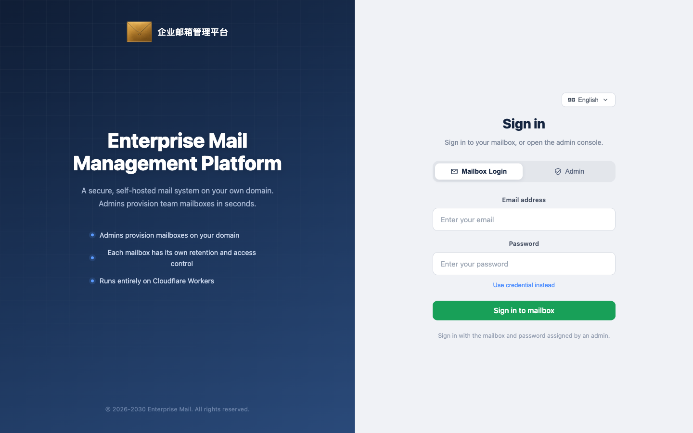
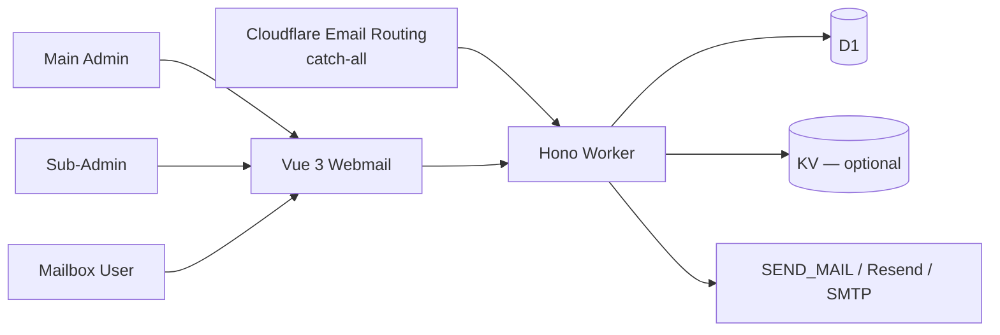

**English** · [中文](./README.zh-CN.md) · [Español](./README.es.md) · [Português (Brasil)](./README.pt-BR.md) · [日本語](./README.ja.md) · [Deutsch](./README.de.md)


# Enterprise Post Office-**Cloudflare**

**No server of your own. A complete, stable enterprise post office that runs on the Cloudflare stack.**


[Highlights](#highlights) · [The product is who may open a box](#the-product-is-who-may-open-a-box) · [Quick start](#quick-start) · [Why this exists](#why-this-exists) · [Architecture](#architecture) · [中文](README.zh-CN.md) · [Español](README.es.md) · [Português](README.pt-BR.md) · [日本語](README.ja.md) · [Deutsch](README.de.md)

Maintainer: [hiFOFA](https://github.com/hiFOFA/enterprise-post-office-cf) · Co-created with [Claude Code](https://www.anthropic.com/claude-code)

Enterprise Post Office runs only on Cloudflare: the Worker is the counter, D1 is the ledger, Email Routing is the inbound dock. You do not buy a machine or run a mail server. You receive on your domain, and you send when an address is allowed to.

This is not temp mail. Every address has a password in this system — sign in, receive, send. It is a complete mail portal. Opening a box is an admin action: the main admin sees the whole site, a sub-admin opens and sees only their own boxes, a mailbox user signs in with address + password and cannot register another.

Each role can mint a full API token with the same reach as clicking around the web UI. The token page ships the usage doc; send that doc to an AI and it can send, receive, and operate mail without reading the source. The public API will not mint an address — `POST /api/new_address` is hard-wired to 403.



Login splits mailbox users from administrators.

## Highlights

- **No server of your own:** it runs on the Cloudflare stack. No MTA to operate. Worker + D1 + Email Routing is the post office.
- **A full mail portal, not temp mail:** the system sends and receives; every mailbox has a password here, so you sign into your own box instead of throwing the address away.
- **Three roles, light management:** main admin sees everything, a sub-admin opens only their boxes, a mailbox user enters with address + password. The person who opens a box is not the person who uses it.
- **Works with automation protocols and AI development:** each role can mint a full API token with the same reach as a human on the web UI. The token-creation page includes the usage doc — send that doc to an AI and it can automate send, receive, and the rest. Docs: [`mailbox-user.md`](frontend/public/api-docs/mailbox-user.md) / [`main-admin.md`](frontend/public/api-docs/main-admin.md) / [`sub-admin.md`](frontend/public/api-docs/sub-admin.md).
- **Admin-provisioned only:** `POST /api/new_address` is hard-wired to **403**. The street cannot mint a box.
- **An agent can deploy it too:** paste the prompt below. It reads the deploy skill, explains every token, and deploys only after verification.

## The product is who may open a box

Many temp-mail stacks can hand out an address. This project exists to answer a different question: who may open a box, who may only use one, and whether sending is a default. You keep the control plane. Cloudflare runs the runtime.

> **In short:** you bring a Cloudflare account and a receiving domain. The post office receives mail and sends under permission. Every mailbox has its own password — a portal, not a disposable address. The public API will not give anyone a box.
>
> **What you notice:** no server to buy. Mailbox users sign in with a password. Three roles keep provisioning apart from daily use. Token reach matches the web UI; send the token-page doc to an AI and it can send and receive for you.

The rules are part of the product:

1. Public `POST /api/new_address` is always **403**. Do not open it for convenience.
2. The main admin signs in with `ADMIN_USERNAME` / `ADMIN_PASSWORD`, opens boxes without spending credits, and can create sub-admins, set quota, sending, and appearance.
3. A sub-admin manages **their** boxes only. Default price is one credit per domain; max expiry is 90 days. They cannot create other sub-admins or change the main password.
4. A mailbox user signs in with `name@domain` + password (or an address JWT), reads mail, and sends only if allowed. They cannot mint an address.
5. Every receiving domain needs Email Routing Catch-all pointed at this Worker, or opened boxes stay silent.
6. The DNS zone and the Worker must live in the **same** Cloudflare account. Subdomain receiving is not inherited from the parent zone.
7. Tokens, passwords, and Account ID belong in the dashboard or secrets — never in git.
8. After deploy, revoke the Cloudflare API token you just gave the agent.

**Admins open boxes. The Worker moves mail. Mailbox users read. You keep the domain and the keys.**

## Quick start

Give this repository to Claude, ChatGPT, or Cursor, then paste:

<p align="center">
  <a href="https://claude.ai"></a>
  <a href="https://chatgpt.com"></a>
  <a href="https://cursor.com"></a>
</p>

```text
Read and follow this skill strictly, then deploy Enterprise Mailbox Management System:

https://raw.githubusercontent.com/hiFOFA/enterprise-post-office-cf/main/skills/deploy-cf-post-office/SKILL.md

Requirements:
1. First, run: git clone https://github.com/hiFOFA/enterprise-post-office-cf.git
2. Ask me one item at a time following the skill to collect deployment info.
3. Explain what each token is for in plain language before asking for it.
4. Confirm whether to use workers.dev or a custom domain on Cloudflare.
5. Deploy only after verifying tokens. Do not skip steps.
6. Provide only the access URL upon completion, and remind me to revoke the temporary API token immediately.
```

The skill file lives at `[skills/deploy-cf-post-office/SKILL.md](skills/deploy-cf-post-office/SKILL.md)`. In Cursor you can also say "Install this project following the deploy skill."

Once up, issue an API token on the token-creation page for the role you need. Send that doc directly to an AI (with the token) to automate send, receive, and management with full web-equivalent permissions:

- Mailbox user: `[frontend/public/api-docs/mailbox-user.md](frontend/public/api-docs/mailbox-user.md)` (live at `/api-docs/mailbox-user.md`)
- Main admin: `[frontend/public/api-docs/main-admin.md](frontend/public/api-docs/main-admin.md)`
- Sub-admin: `[frontend/public/api-docs/sub-admin.md](frontend/public/api-docs/sub-admin.md)`

For manual setup, see [Full deployment guide](#full-deployment-guide) below.

## Why this exists

Operating your own MTA gives full control over provisioning and sending, but adds a server to patch and queues to nurse. Public temp-mail is zero-ops, but leaves box creation open to the street. This project keeps the control plane and hands runtime to Cloudflare: Email Routing is the inbound dock, Worker is the post office, D1 is the ledger.

| Common approach | What this post office does | Direct benefit |
|---|---|---|
| Buy a machine, maintain an MTA | Runs on Cloudflare: Worker + D1 + Email Routing | **No server to buy** |
| Disposable temp mail: one-time address, receive-only | Every mailbox has a password: login, receive, send | **A complete mail portal** |
| No roles, or single admin | Main admin / Sub-admin / Mailbox user | **Provisioning separated from usage** |
| Read source to write API clients | Full token + usage doc on token creation page | **Send doc to AI for instant automation** |
| Public temp mail: anyone mints addresses | Box creation is admin-only; `POST /api/new_address` is 403 | **Zero unwanted mailbox creation** |

Public registration is disabled. Keep it disabled on your deployment.

## Architecture



The system separates box creation, transport, daily usage, and keys: main admin plans the site; sub-admin opens only their boxes; mailbox user reads and sends under permission; Worker handles ingress and egress; D1 records addresses and permissions. No public endpoint mints a box.

### Three roles

| Role | Identity | What it can do |
|---|---|---|
| **Main admin** | Secret: `ADMIN_USERNAME` / `ADMIN_PASSWORD` | Sees all mailboxes and creators. No points deducted. Creates sub-admins, sets quota, domain pricing, appearance, sending, IP, webhook. JWT in `x-admin-auth` (`role: main`). |
| **Sub-admin** | D1 table `sub_admins` | Manages **own** boxes only. Shared quota, 1 point per domain by default, max expiry **90 days**. Cannot create sub-admins or modify main credentials. `role: sub`. |
| **Mailbox user** | Existing address | Signs in at `/login` with `name@domain` + password (or address JWT). Reads mail, sends when permitted. Cannot mint a box. `Authorization: Bearer <jwt>`. |

Site gate: `PASSWORDS` via `x-custom-auth`. UI language: `x-lang` = `zh` / `en` / `es` / `pt-BR` / `ja` / `de`.

Address occupancy: an active, unexpired row reserves the name. Expired boxes drop mail.

> [!NOTE]
> Point Email Routing **Catch-all** to this Worker on every receiving domain. DNS zone and Worker must live in the same Cloudflare account.

## Full deployment guide

Use agent-assisted deploy in [Quick start](#quick-start), or follow manual steps below.

### Requirements

- Cloudflare account
- Receiving domain in the **same account**
- [pnpm](https://pnpm.io) (locked to pnpm@10)
- Wrangler 4

```bash
git clone https://github.com/hiFOFA/enterprise-post-office-cf.git
cd enterprise-post-office-cf
```

### 1. Database

Create a D1 database named `DB`:

- New database: execute `[db/schema.sql](db/schema.sql)`
- Existing database: apply patches in `[db/](db/)`

KV is optional (for Telegram / Webhook).

### 2. Worker

```bash
cd worker
cp wrangler.toml.template wrangler.toml
```

Set `DOMAINS` / `DEFAULT_DOMAINS`, D1, and credentials in **Wrangler secrets**:

```bash
npx wrangler secret put ADMIN_USERNAME
npx wrangler secret put ADMIN_PASSWORD
```

Deploy:

```bash
pnpm i
pnpm deploy
```

### 3. Frontend

```bash
cd frontend
pnpm i
pnpm build
```

Enable `[assets]` in `worker/wrangler.toml` pointing to `../frontend/dist`, then `pnpm deploy` from `worker/`.

### 4. Receiving

Set Cloudflare Email Routing Catch-all to this Worker.

## Verification

- `GET /health_check` → 200
- `GET /open_api/bootstrap` → 200 with site info
- `GET /open_api/settings` unauthenticated → **401**
- `/` → Login page HTML
- `POST /api/new_address` → **403**

```bash
# Frontend test
cd frontend && pnpm test
```

## Security boundaries & limits

- Public self-registration is permanently disabled.
- Main password is encrypted on the client using SHA-256 before transit.
- Cloudflare API tokens, Account ID, and D1 ID stay in secrets / dashboard — never commit to git.
- Catch-all captures all domain mail. Do not point a live production inbox here without intent.

## History & License

Based on [cloudflare_temp_email](https://github.com/dreamhunter2333/cloudflare_temp_email) and redesigned into an Enterprise Post Office.

[MIT](LICENSE). Version v1.0.

MIT © [hiFOFA](https://github.com/hiFOFA/enterprise-post-office-cf). Upstream copyright see [LICENSE](LICENSE).

Special thanks: Based on [cloudflare_temp_email](https://github.com/dreamhunter2333/cloudflare_temp_email).
