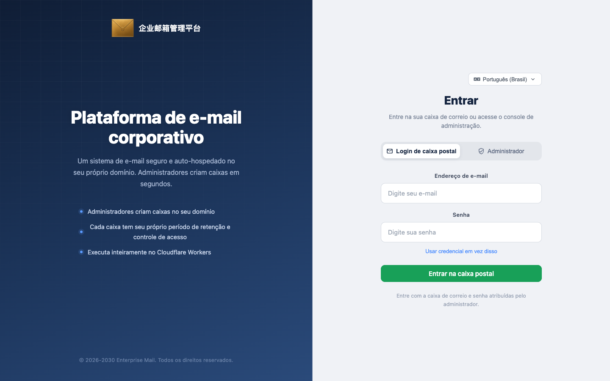

[English](./README.md) · [中文](./README.zh-CN.md) · [Español](./README.es.md) · **Português (Brasil)** · [日本語](./README.ja.md) · [Deutsch](./README.de.md)


# Enterprise Post Office-**Cloudflare**

**Sem necessidade de servidor próprio. Uma solução completa e estável de correio empresarial executada no ecossistema Cloudflare.**


[Destaques](#destaques) · [O direito de criar contas é o produto](#o-direito-de-criar-contas-é-o-produto) · [Início rápido](#início-rápido) · [Por que correio empresarial](#por-que-correio-empresarial) · [Arquitetura](#arquitetura) · [English](README.md) · [中文](README.zh-CN.md) · [Español](README.es.md) · [日本語](README.ja.md) · [Deutsch](README.de.md)

Mantenedor: [hiFOFA](https://github.com/hiFOFA/enterprise-post-office-cf) · Co-criado com: [Claude Code](https://www.anthropic.com/claude-code)

O correio empresarial funciona exclusivamente no Cloudflare: Workers como balcão, D1 como livro-razão e Email Routing como doca de entrada. Sem comprar máquinas ou manter servidores de e-mail. O domínio recebe e-mails e, após autorização, pode enviar.

Não se trata de e-mail temporário. Cada endereço possui sua própria senha neste sistema, permitindo login, recebimento e envio como um portal de e-mail completo. A abertura de contas é feita exclusivamente pelo painel de administração: o administrador principal supervisiona todo o sistema, o subadministrador gerencia apenas suas próprias caixas e os usuários entram com endereço e senha, sem registro anônimo.

O sistema emite tokens de API completos para cada perfil, com os mesmos privilégios da interface web. A página de criação de tokens inclui documentação própria; envie esse documento diretamente para uma IA para automatizar recebimento, envio e gerenciamento de caixas sem precisar examinar o código-fonte. A interface pública não permite auto-cadastro — `POST /api/new_address` retorna sempre 403.



A página de login separa os usuários de caixa postal dos administradores.

## Destaques

- **Sem necessidade de servidor próprio:** Executa no ecossistema Cloudflare sem configuração de MTA. Worker + D1 + Email Routing formam o serviço de correio.
- **Portal de e-mail completo, não e-mail temporário:** O sistema oferece recebimento e envio; cada caixa possui senha própria em vez de ser um endereço descartável.
- **Três níveis de identidade, gerenciamento simples:** Administrador principal supervisiona tudo, subadministrador gerencia suas caixas e os usuários entram com endereço e senha.
- **Excelente compatibilidade com protocolos de automação e IA:** Cada perfil pode emitir tokens de API com permissões equivalentes às da interface web. A documentação vem inclusa na página de tokens. Docs: [`mailbox-user.md`](frontend/public/api-docs/mailbox-user.md) / [`main-admin.md`](frontend/public/api-docs/main-admin.md) / [`sub-admin.md`](frontend/public/api-docs/sub-admin.md).
- **Criação de contas exclusiva para administradores:** `POST /api/new_address` é fixado em **403**.
- **Implantação assistida por IA:** Copie o prompt abaixo para que um assistente de IA guie a configuração e faça a implantação após validar os tokens.

## O direito de criar contas é o produto

Muitos serviços de e-mail temporário fornecem um endereço. O correio empresarial controla quem tem o direito de criar caixas, quem apenas as utiliza e se o envio está habilitado. O controle fica com você, executado no Cloudflare.

> **Em resumo:** Você só precisa de uma conta Cloudflare e um domínio para receber e-mails. O sistema cuida do recebimento e do envio conforme as permissões. Cada caixa possui senha própria. Chamadas anônimas pela API pública são bloqueadas.

Regras fundamentais do produto:

1. `POST /api/new_address` retorna sempre **403**.
2. O administrador principal entra com `ADMIN_USERNAME` / `ADMIN_PASSWORD`, cria caixas sem limite de saldo, gerencia subadministradores, cotas, remetentes e aparência.
3. O subadministrador gerencia apenas **suas próprias** caixas, com desconto de pontos por domínio e validade de até 90 dias.
4. O usuário entra com `usuario@dominio` + senha (ou JWT do endereço) para ler e enviar e-mails autorizados.
5. Cada domínio de recebimento deve habilitar o Catch-all no Email Routing apontando para este Worker.
6. A zona DNS e o Worker devem estar na **mesma** conta Cloudflare.
7. Tokens, senhas e Account ID devem ficar nos secrets ou painel, nunca no git.
8. Revogue os tokens de API temporários após concluir a implantação.

## Início rápido

Entregue este repositório ao Claude, ChatGPT ou Cursor e cole o seguinte comando:

<p align="center">
  <a href="https://claude.ai"></a>
  <a href="https://chatgpt.com"></a>
  <a href="https://cursor.com"></a>
</p>

```text
请先读取并严格遵守这个技能，然后帮我部署「企业邮箱管理系统」：

https://raw.githubusercontent.com/hiFOFA/enterprise-post-office-cf/main/skills/deploy-cf-post-office/SKILL.md

要求：
1. 先 git clone https://github.com/hiFOFA/enterprise-post-office-cf.git
2. 按技能一项一项问我，收集部署需要的信息
3. 每要一个令牌，都用白话说明它用来干什么；并说明令牌只保存在本次会话，不会写入仓库
4. 问我站点用 Worker 自带的 workers.dev，还是我提供的、已在 Cloudflare 上的域名
5. 令牌验证通过后再部署，不要跳步
6. 完成后只告诉我访问域名；提醒我立刻到 Cloudflare 仪表盘撤销刚才发给你的 API 令牌
```

## Arquitetura do sistema

- **Cloudflare Workers:** Roteamento HTTP, lógica de negócios e despacho de e-mails.
- **Cloudflare D1:** Banco de dados relacional SQLite distribuído.
- **Cloudflare Email Routing:** Roteamento de e-mails recebidos para o Worker.
- **Frontend Vue 3:** Compilado e integrado ao Worker pelo binding `[assets]`.

## Licença

[MIT](LICENSE). Versão v1.0.

MIT © [hiFOFA](https://github.com/hiFOFA/enterprise-post-office-cf). Upstream: [cloudflare_temp_email](https://github.com/dreamhunter2333/cloudflare_temp_email).
